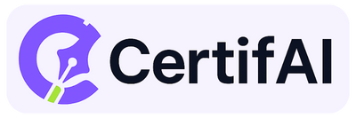

# CertifAI

An AI-powered, blockchain-based document management platform that provides secure, legally trustworthy digital workflows for document creation, collaboration, and verification.

## 🌟 Features

- **🔗 Blockchain Immutability**: Every document action is recorded on Polygon blockchain with SHA-256 hashing
- **🤖 AI Document Wizard**: Generate and edit documents using natural language prompts
- **👥 Real-time Collaboration**: Multiple users can edit documents simultaneously
- **✍️ Digital Signatures**: Secure e-signature functionality with tamper-proof verification
- **🔍 Document Verification**: AI-powered external document comparison and fraud detection
- **📊 Activity Log**: Complete audit trail of all document interactions
- **🔒 Privacy Controls**: Private/public document visibility settings with granular permissions

## 🎯 Target Users

- Students and faculty
- MSMEs and freelancers
- Organizations and businesses
- Seniors and persons with disabilities (PWDs)
- Anyone needing secure document management

## 🛠️ Tech Stack

### Frontend
- **React.js** with TypeScript
- **Tailwind CSS** for styling
- **Syncfusion API** for document editing

### Backend
- **Node.js** with **Express** and TypeScript
- **MongoDB** for data storage
- **Google OAuth** for authentication

### Integration
- **Groq AI API** for document generation
- **Polygon Amoy** blockchain for immutable records
- **Alchemy RPC** for blockchain connectivity

## 🚀 Key Benefits

- **Cost-effective**: ₱0.02 per blockchain transaction
- **Secure**: Tamper-proof blockchain verification
- **Compliant**: Meets Philippine Supreme Court electronic notarization requirements

## 📋 Core Workflows

1. **Document Creation**: Upload or AI-generate documents with blockchain timestamping
2. **Collaborative Editing**: Multi-user editing with version control
3. **Digital Signing**: Secure signature with automatic document locking
4. **Verification**: Compare external documents against authoritative versions
5. **Audit Trail**: Complete activity log with blockchain proof

## 🔧 Getting Started

1. Clone the repository
2. Install dependencies for both frontend and backend
3. Configure environment variables
4. Run the development servers

## 🤝 Contributing

We welcome contributions from the community. Please contact any of our developers and submit pull requests for any improvements.

## 📚 Learn More
Prefer watching over reading? 📺
Check out our [video walkthrough](https://drive.google.com/file/d/1_XmIIAAWNJgEpWHADiMiSAOhasa5sUCB/view?usp=sharing) to see CertifAI in action!
Love diving into documentation? 📖
Explore the complete [project documentation](https://drive.google.com/file/d/1Pucdq-m3AtD5YCKb48cyGaHLaRr7sTuP/view?usp=sharing) for technical details and implementation insights.

Or, you can just visit [CertifAI](https://certif-ai.vercel.app)

---

**CertifAI** - Bridging AI and Blockchain for Secure Digital Transformation
