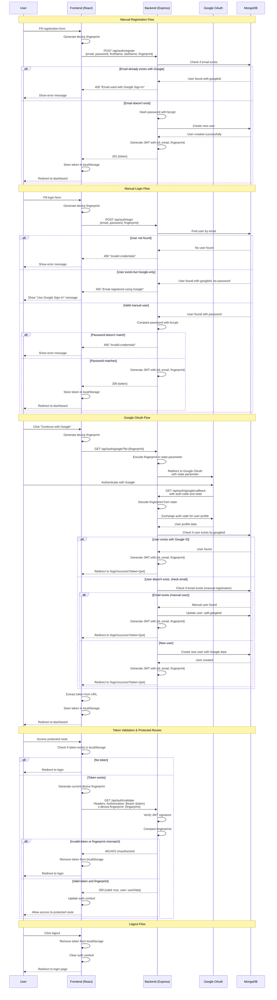

```mermaid
sequenceDiagram
    participant U as User
    participant F as Frontend (React)
    participant B as Backend (Express)
    participant G as Google OAuth
    participant DB as MongoDB

    Note over U,DB: Manual Registration Flow
    U->>F: Fill registration form
    F->>F: Generate device fingerprint
    F->>B: POST /api/auth/register<br/>{email, password, firstName, lastName, fingerprint}
    B->>DB: Check if email exists
    alt Email already exists with Google
        DB-->>B: User found with googleId
        B-->>F: 400 "Email used with Google Sign-In"
        F-->>U: Show error message
    else Email doesn't exist
        B->>B: Hash password with bcrypt
        B->>DB: Create new user
        DB-->>B: User created successfully
        B->>B: Generate JWT with {id, email, fingerprint}
        B-->>F: 201 {token}
        F->>F: Store token in localStorage
        F-->>U: Redirect to dashboard
    end

    Note over U,DB: Manual Login Flow
    U->>F: Fill login form
    F->>F: Generate device fingerprint
    F->>B: POST /api/auth/login<br/>{email, password, fingerprint}
    B->>DB: Find user by email
    alt User not found
        DB-->>B: No user found
        B-->>F: 400 "Invalid credentials"
        F-->>U: Show error message
    else User exists but Google-only
        DB-->>B: User found with googleId, no password
        B-->>F: 400 "Email registered using Google"
        F-->>U: Show "Use Google Sign-In" message
    else Valid manual user
        DB-->>B: User found with password
        B->>B: Compare password with bcrypt
        alt Password doesn't match
            B-->>F: 400 "Invalid credentials"
            F-->>U: Show error message
        else Password matches
            B->>B: Generate JWT with {id, email, fingerprint}
            B-->>F: 200 {token}
            F->>F: Store token in localStorage
            F-->>U: Redirect to dashboard
        end
    end

    Note over U,DB: Google OAuth Flow
    U->>F: Click "Continue with Google"
    F->>F: Generate device fingerprint
    F->>B: GET /api/auth/google?fp={fingerprint}
    B->>B: Encode fingerprint in state parameter
    B->>G: Redirect to Google OAuth<br/>with state parameter
    U->>G: Authenticate with Google
    G->>B: GET /api/auth/google/callback<br/>with auth code and state
    B->>B: Decode fingerprint from state
    B->>G: Exchange auth code for user profile
    G-->>B: User profile data
    B->>DB: Check if user exists by googleId
    alt User exists with Google ID
        DB-->>B: User found
        B->>B: Generate JWT with {id, email, fingerprint}
        B-->>F: Redirect to /login/success?token={jwt}
    else User doesn't exist, check email
        B->>DB: Check if email exists (manual registration)
        alt Email exists (manual user)
            DB-->>B: Manual user found
            B->>DB: Update user: add googleId
            B->>B: Generate JWT with {id, email, fingerprint}
            B-->>F: Redirect to /login/success?token={jwt}
        else New user
            B->>DB: Create new user with Google data
            DB-->>B: User created
            B->>B: Generate JWT with {id, email, fingerprint}
            B-->>F: Redirect to /login/success?token={jwt}
        end
    end
    F->>F: Extract token from URL
    F->>F: Store token in localStorage
    F-->>U: Redirect to dashboard

    Note over U,DB: Token Validation & Protected Routes
    U->>F: Access protected route
    F->>F: Check if token exists in localStorage
    alt No token
        F-->>U: Redirect to login
    else Token exists
        F->>F: Generate current device fingerprint
        F->>B: GET /api/auth/validate<br/>Headers: Authorization: Bearer {token}<br/>x-device-fingerprint: {fingerprint}
        B->>B: Verify JWT signature
        B->>B: Compare fingerprints
        alt Invalid token or fingerprint mismatch
            B-->>F: 401/403 Unauthorized
            F->>F: Remove token from localStorage
            F-->>U: Redirect to login
        else Valid token and fingerprint
            B-->>F: 200 {valid: true, user: userData}
            F->>F: Update auth context
            F-->>U: Allow access to protected route
        end
    end

    Note over U,DB: Logout Flow
    U->>F: Click logout
    F->>F: Remove token from localStorage
    F->>F: Clear auth context
    F-->>U: Redirect to login page
```
